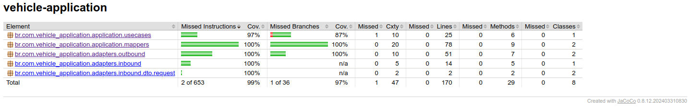

# Hackaton - API Users


API responsável por fazer a criação do usuário, geração e validação do token de acesso.

# Pré-requisitos
1. Docker
   1. Para instalação [clique aqui](https://www.docker.com/get-started/)
2. Docker compose
   1. Para instalação [clique aqui](https://docs.docker.com/compose/install/)
3. Docker Desktop
   1. Para instalação [clique aqui](https://www.docker.com/products/docker-desktop/)
4. Habilitar o Kubernetes através do menu de configuração do Docker Desktop
   1. Após abrir o Docker Desktop, clique na engrnagem no canto superior direito;
   2. Vá em "Kubernetes"
   3. Habilite o Kubernetes selecionando o check box "Enable Kubernetes"

# Para executar o projeto:
1. Acesse via terminal a pasta do projeto
2. Execute em ordem os comandos abaixo: 
```bash
kubectl apply -f kubernetes --recursive  # você vai criar todos os recursos kubernetes que estão dentro da pasta 'kubernetes/'
```

### Obs.: Caso esteja utilizando o minikube para rodar seu cluster local, é necessário executar o campo abaixo:
```bash
kubectl get svc # neste comando você listará todas as services. Localize a service do app
kubectl port-forward svc-lanchonete-app-cliente 8080:80 # neste comando você vai direcionar todas as chamadas da porta 8080 para a porta 80 do cluster
```

#### Após os passos acima, a API estará funcionando e será possível realizar as operações, conforme descrito abaixo.

# Passo a passo funcional da API

### **Operações Disponíveis nesta API**
  
**Rota:** `/create`  
**Descrição:** Realiza o cadastro de um usuário.  
**Body:**

```json
{
   "email": "string",
   "password": "string"
}
```

  
**Rota:** `/auth`  
**Descrição:** Faz a geração do JWT.
**Body:**

```json
{
   "email": "string",
   "password": "string"
}
```

  
**Rota:** `/auth/validate`  
**Descrição:** Realiza a validação do JWT.
**Header**: Authorization: Bearer <jwt>

# Documentações
## Desenho da arquitetura


# Relatório de cobertura de teste

### Para executar os testes unitários execute o comando abaixo:
```bash
./gradlew clean build
```
**Localização do relatório**: build/jacocoReport/index.html  
**Cobertura mínima**: 90%

