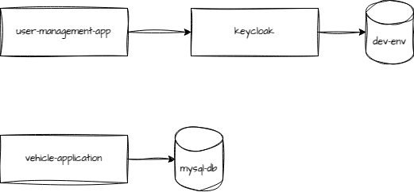

# Vehicle Application

API responsável por fazer a gestão dos veículos, incluindo cadastro, listagem de veículos vendidos e disponíveis para venda, edição e compra.

# Pré-requisitos
1. Docker
   1. Para instalação [clique aqui](https://www.docker.com/get-started/)
2. Docker compose
   1. Para instalação [clique aqui](https://docs.docker.com/compose/install/)
3. Docker Desktop
   1. Para instalação [clique aqui](https://www.docker.com/products/docker-desktop/)
4. Habilitar o Kubernetes através do menu de configuração do Docker Desktop
   1. Após abrir o Docker Desktop, clique na engrnagem no canto superior direito;
   2. Vá em "Kubernetes"
   3. Habilite o Kubernetes selecionando o check box "Enable Kubernetes"

# Para executar o projeto:
1. Acesse via terminal a pasta do projeto
2. Execute em ordem os comandos abaixo: 
```bash
kubectl apply -f kubernetes --recursive  # você vai criar todos os recursos kubernetes que estão dentro da pasta 'kubernetes/'
```

#### Após os passos acima, a API estará funcionando e será possível realizar as operações, conforme descrito abaixo.

# Passo a passo funcional da API

### **Operações Disponíveis nesta API**
  
**Rota:** `/vehicle`  
**Descrição:** Realiza a criação de um veículo.  
**Header**: Authorization: Bearer <jwt>  
**Body:**

```json
{
   "brand": "chevrolet",
   "model": "onix",
   "modelYear": "2020",
   "factoryYear": "2020",
   "color": "white",
   "price": 1,
   "marketReferenceCode": "5",
   "toSell": true
}
```

  
**Rota:** `/vehicle`  
**Descrição:** Edita os dados do veículo.  
**Header**: Authorization: Bearer <jwt>  
**Body:**

```json
{
   "brand": "chevrolet",
   "model": "onix",
   "modelYear": "2020",
   "factoryYear": "2020",
   "color": "white",
   "price": 1,
   "marketReferenceCode": "2",
   "toSell": true
}
```

  
**Rota:** `/vehicle/buy`  
**Descrição:** Realiza a compra de um veículo.  
**Header**: Authorization: Bearer <jwt>  
**Body:**

```json
{
   "marketReferenceCode": "5"
}
```

  
**Rota:** `/vehicle/sold`  
**Descrição:** Lista todos os veículos vendidos.  
**Header**: Authorization: Bearer <jwt>  

  
**Rota:** `/vehicle/sales`  
**Descrição:** Lista todos os veículos disponíveis para venda.  
**Header**: Authorization: Bearer <jwt>


# Documentações
## Desenho da arquitetura



# Relatório de cobertura de teste

### Para executar os testes unitários execute o comando abaixo:
```bash
./gradlew clean build
```
**Localização do relatório**: build/jacocoReport/index.html  
**Cobertura mínima**: 90%

